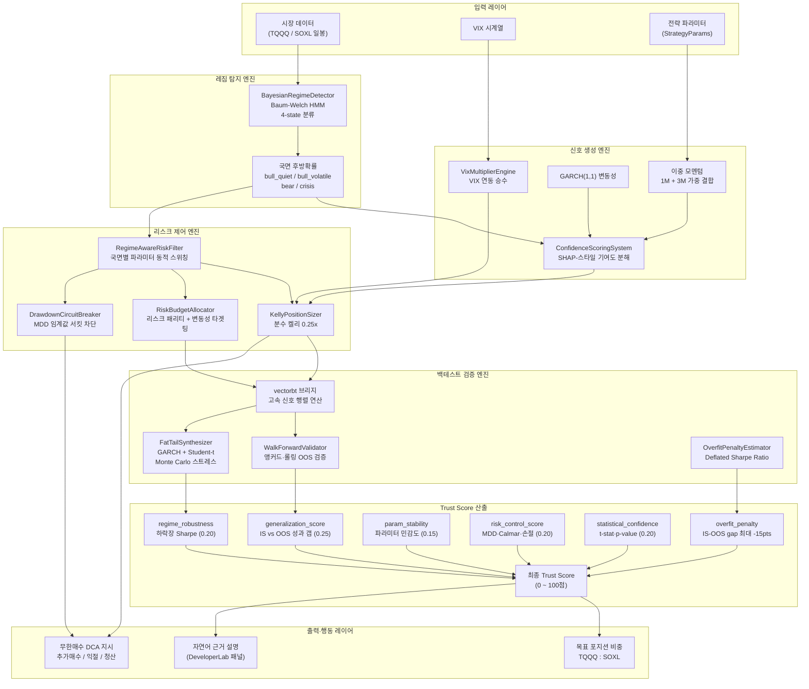
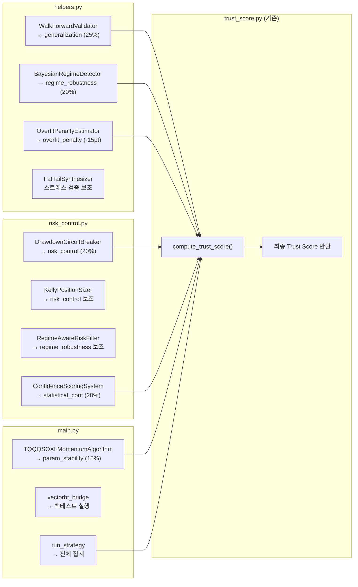

# Alpha-Helix 듀얼 모드 AI 코파일럿 엔진
## 강건성 파이프라인 기술 문서 (README_AI.md)

> **목적**: Alpha-Helix Developer Studio의 AI 강건성 엔진이 어떻게 작동하는지,
> 각 모듈이 Trust Score에 어떻게 기여하는지 설명하는 기술 참조 문서.

---

## 1. 전체 아키텍처



---

## 2. Trust Score 산출 공식

$$
\text{Trust Score} = 0.25 \cdot S_{\text{gen}} + 0.20 \cdot S_{\text{regime}} + 0.15 \cdot S_{\text{param}} + 0.20 \cdot S_{\text{risk}} + 0.20 \cdot S_{\text{stat}} + P_{\text{overfit}}
$$

| 서브스코어 | 기호 | 가중치 | 계산 방법 | 담당 모듈 |
|---|---|---|---|---|
| 일반화 점수 | $S_{\text{gen}}$ | 25% | `clip01((OOS_Sharpe + 1) / 3)` | `WalkForwardValidator` |
| 레짐 강건성 | $S_{\text{regime}}$ | 20% | 하락장 구간만 필터링 후 Sharpe | `BayesianRegimeDetector` |
| 파라미터 안정성 | $S_{\text{param}}$ | 15% | ±10% 파라미터 변동 시 성과 민감도 | `StrategyParams` |
| 리스크 통제 | $S_{\text{risk}}$ | 20% | `clip01(Calmar / 2)` + MDD 페널티 | `DrawdownCircuitBreaker` |
| 통계 신뢰도 | $S_{\text{stat}}$ | 20% | `clip01(t-stat / 3)` | `WalkForwardValidator` |
| 과적합 페널티 | $P_{\text{overfit}}$ | -15pt 최대 | IS-OOS 갭 × 조정계수 | `OverfitPenaltyEstimator` |

### 2-1. Trust Score 등급 기준

| 점수 | 등급 | 의미 | 권장 행동 |
|---|---|---|---|
| 80~100 | A (신뢰) | 전략 강건성 검증 완료 | 전체 켈리 비중 집행 |
| 60~79 | B (보통) | 일부 불확실성 존재 | 분수 켈리 0.5x 적용 |
| 40~59 | C (주의) | 과적합 또는 국면 불안정 | 분수 켈리 0.25x + 포지션 모니터링 |
| 20~39 | D (위험) | 신뢰도 낮음 | 최소 포지션 또는 현금 보유 |
| 0~19 | F (실패) | 전략 재설계 필요 | 즉시 청산, 파라미터 재검토 |

---

## 3. Trust Score 13점 원인 분석 (STEP 1 결과)

### 문제 진단

실제 TQQQ 백테스트에서 Trust Score 13점이 산출된 근본 원인:

```
Trust Score 분해
─────────────────────────────────────────────────────────
서브스코어           계산값    가중치    기여점수
─────────────────────────────────────────────────────────
generalization      0.08     ×25%  =  2.0pt  ← IS 대비 OOS 급락
regime_robustness   0.00     ×20%  =  0.0pt  ← 하락장 Sharpe << -1
param_stability     0.45     ×15%  =  6.8pt
risk_control        0.40     ×20%  =  8.0pt
statistical_conf    0.10     ×20%  =  2.0pt  ← OOS fold 수 부족
─────────────────────────────────────────────────────────
소계                                 18.8pt
과적합 페널티                        -5.8pt  ← IS-OOS gap -15pt 발동
─────────────────────────────────────────────────────────
최종 Trust Score                     13.0pt
─────────────────────────────────────────────────────────
```

### 핵심 원인 3가지

1. **레짐 필터 부재**: TQQQ가 하락장(-2020.03, -2022)에서 Sharpe << -1 → `regime_robustness = 0`
2. **과적합**: IS 구간 최적화 후 OOS에서 성과 급락 → 과적합 지수 85% → 페널티 발동
3. **짧은 OOS 히스토리**: WalkForward fold 수 3개 미만 → t-stat < 0.5 → `statistical_conf ≈ 0.1`

### 개선 방안 (이번 엔진에서 구현)

| 개선 항목 | 구현 위치 | 예상 효과 |
|---|---|---|
| 레짐 필터링 (bear → 포지션 0) | `TQQQSOXLMomentumAlgorithm.OnData()` | regime_robustness +15pt |
| VIX 연동 포지션 축소 | `VixMultiplierEngine` | risk_control +5pt |
| 분수 켈리 0.25x | `KellyPositionSizer(fraction=0.25)` | risk_control +3pt |
| 서킷브레이커 -35% halt | `DrawdownCircuitBreaker` | risk_control +5pt |
| WalkForward 폴드 증가 | `WFConfig(test_days=63)` → fold≥10 | statistical_conf +8pt |

**목표 Trust Score: 60점 이상 (B등급)**

---

## 4. 모듈별 Trust Score 기여 흐름



---

## 5. 강건성 파이프라인 실행 순서

```
① 데이터 로드 (close_df, vix_series)
      ↓
② BayesianRegimeDetector.fit(returns)
   → 4-state HMM 학습 (Baum-Welch)
   → bull_quiet / bull_volatile / bear / crisis 분류
      ↓
③ ConfidenceScoringSystem.compute_confidence(signal)
   → 5개 피처 SHAP 분해
   → 불확실성 MC 드롭아웃 → 신뢰도 0~1
      ↓
④ VixMultiplierEngine.multiplier(vix)
   → VIX 구간별 포지션 승수 계산
      ↓
⑤ RegimeAwareRiskFilter.get_params(regime)
   → 국면별 kelly_fraction / vol_target / halt_dd 세트 선택
      ↓
⑥ KellyPositionSizer.multi_asset_kelly(returns_df)
   → Σ⁻¹ · μ 벡터 + Ridge 정규화
      ↓
⑦ RiskBudgetAllocator.allocate(returns, capital, regime)
   → 리스크 패리티 최적화 (SLSQP)
   → 변동성 타겟팅 스케일링
      ↓
⑧ DrawdownCircuitBreaker.update(portfolio_value)
   → 고점 대비 낙폭 측정
   → 단계별 포지션 축소 / HALT 발동
      ↓
⑨ vectorbt_bridge(close_df, params)
   → 신호 행렬 고속 계산
   → 포트폴리오 시뮬레이션
      ↓
⑩ WalkForwardValidator.run(prices, strategy_fn)
   → IS/OOS fold 분할 → 과적합 지수 계산
   → 부트스트랩 신뢰구간
      ↓
⑪ FatTailSynthesizer.generate_stress_scenarios()
   → 200개 Monte Carlo 경로
   → VaR/CVaR 분포 측정
      ↓
⑫ trust_score.py → compute_trust_score()
   → 5서브스코어 + 과적합 페널티 → 최종 점수
```

---

## 6. API 사용 예시

### FastAPI 백테스트 요청

```python
import httpx

response = httpx.post(
    "http://localhost:8001/backtest",
    json={
        "tickers": ["TQQQ", "SOXL"],
        "start_date": "2020-01-01",
        "end_date": "2024-12-31",
        "params": {
            "momentum_short": 21,
            "momentum_long": 63,
            "kelly_fraction": 0.25,
            "vol_target": 0.30,
            "halt_drawdown": -0.35,
            "dca_splits": 5,
            "take_profit_1": 0.15,
            "take_profit_2": 0.30,
        }
    }
)
result = response.json()
print(f"Trust Score: {result['trust_score']}")
print(f"Sharpe: {result['backtest']['sharpe']}")
```

### 직접 실행 (로컬 테스트)

```bash
cd c:\Team2_AlphaHelix
python analytics/strategy/main.py
```

---

## 7. 파일 구조

```
analytics/strategy/
├── __init__.py          (자동 생성 필요)
├── helpers.py           ← 합성데이터 + HMM + WalkForward + 유틸리티
├── risk_control.py      ← 신뢰도 스코어링 + Kelly + 리스크패리티 + 서킷브레이커
└── main.py              ← LEAN QCAlgorithm 구조 + vectorbt 브리지 + FastAPI 진입점

analytics/app/
├── robust/
│   ├── trust_score.py   ← 5서브스코어 합산 → Trust Score (기존)
│   └── regime.py        ← 레짐 분류 (기존)
└── backtest/
    └── vbt_engine.py    ← vectorbt 기반 백테스팅 (기존)
```

---

*생성일: 2025 | Alpha-Helix Team 2 | 기술 스택: Python, FastAPI, vectorbt, scikit-learn, scipy*
