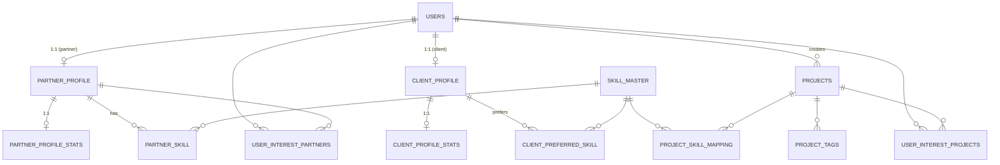
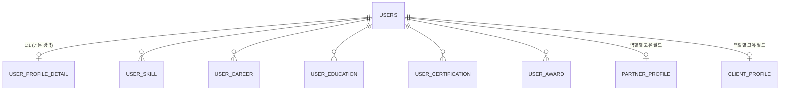

# DevBridge ERD — Current Implementation Snapshot

> 본 문서는 `src/main/java/com/DevBridge/devbridge/entity/` 디렉토리의 **실제 JPA 엔티티 구현 기준**으로 작성된 최신 스냅샷입니다.
> 설계 단계 문서(`ERD_v2.md`)와 달리 지금 코드로 생성되는 실제 테이블만 포함합니다.
> 최종 업데이트: **2026-04-20** (찜 기능 전 구간 연결 + 계좌 1원 인증 목업 연결 완료)

## 변경 이력

| 날짜 | 변경 사항 |
|------|-----------|
| 2026-04-20 | 찜 기능 `user_interest_projects/partners` FE↔API↔DB 3단 연결 완료 |
| 2026-04-20 | `users.bank_verified` 컬럼 추가 + 1원 인증 목업 플로우 연결 |
| 2026-04-20 | `BankVerificationController`에 401 UNAUTHORIZED 분기 추가 (500 폴백 제거) |

---

## 1. 테이블 전체 목록 (14개)

| # | 테이블명 | 도메인 | 비고 |
|---|----------|--------|------|
| 1 | `users` | User | 로그인 + 계정 + 계좌 정보 |
| 2 | `partner_profile` | Partner | 파트너 프로필 (1:1 users) |
| 3 | `client_profile` | Client | 클라이언트 프로필 (1:1 users) |
| 4 | `partner_profile_stats` | Partner | 파트너 통계 집계 |
| 5 | `client_profile_stats` | Client | 클라이언트 통계 집계 |
| 6 | `partner_skill` | Partner | 파트너-스킬 매핑 |
| 7 | `client_preferred_skill` | Client | 클라이언트 선호 스킬 매핑 |
| 8 | `skill_master` | Master | 스킬 사전 |
| 9 | `project_field_master` | Master | 프로젝트 분야 사전 |
| 10 | `projects` | Project | 프로젝트 본체 (외주/상주 통합) |
| 11 | `project_skill_mapping` | Project | 프로젝트-스킬 매핑 (필수/우대) |
| 12 | `project_tags` | Project | 프로젝트 해시태그 |
| 13 | `user_interest_partners` | Interest | 관심 파트너 |
| 14 | `user_interest_projects` | Interest | 관심 프로젝트 |

---

## 2. 관계도 (Mermaid)

---

## 3. 테이블 상세

### 3.1 `users`

| 컬럼 | 타입 | 제약 | 설명 |
|------|------|------|------|
| id | BIGINT | PK, AUTO | 사용자 ID |
| email | VARCHAR(100) | UNIQUE, NOT NULL | 로그인 이메일 |
| username | VARCHAR(50) | UNIQUE, NOT NULL | 표시 이름 |
| password | VARCHAR(255) | NOT NULL | 해시된 비밀번호 |
| phone | VARCHAR(20) | NOT NULL | 전화번호 |
| user_type | ENUM | NOT NULL | `PARTNER` / `CLIENT` |
| interests | TEXT | NOT NULL | 관심사 (자유 텍스트) |
| contact_email | VARCHAR(100) | | 연락용 이메일 |
| gender | ENUM | | `MALE` / `FEMALE` / `OTHER` |
| birth_date | DATE | | 생년월일 |
| region | VARCHAR(50) | | 거주 지역 |
| tax_email | VARCHAR(100) | | 세금계산서 이메일 |
| fax_number | VARCHAR(50) | | 팩스 |
| bank_name | VARCHAR(50) | | 은행명 |
| bank_account_number | VARCHAR(50) | | 계좌번호 |
| bank_account_holder_name | VARCHAR(50) | | 예금주 |
| **bank_verified** | BOOLEAN | NOT NULL, DEFAULT false | **1원 인증 완료 여부** *NEW* |
| profile_image_url | VARCHAR(512) | | 프로필 이미지 |
| created_at | DATETIME | NOT NULL | 가입일 |
| updated_at | DATETIME | NOT NULL | 수정일 |

---

### 3.2 `partner_profile`

| 컬럼 | 타입 | 제약 | 설명 |
|------|------|------|------|
| id | BIGINT | PK, AUTO | |
| user_id | BIGINT | FK→users, **UNIQUE** | 1:1 연결 |
| name | VARCHAR(50) | | 공개 표시 이름 |
| title | VARCHAR(200) | | 직함 |
| hero_key | VARCHAR(30) | | Hero 이미지 키 |
| service_field | VARCHAR(50) | | 서비스 분야 |
| slogan | VARCHAR(200) | NOT NULL | 슬로건 |
| slogan_sub | VARCHAR(255) | | 서브 슬로건 |
| bio | TEXT | | 자기소개 |
| strength_desc | TEXT | | 강점 설명 |
| avatar_color | VARCHAR(16) | | 아바타 배경색 |
| work_category | ENUM | NOT NULL | `DEVELOP` / `PLANNING` / `DESIGN` / `DISTRIBUTION` |
| job_roles | JSON | NOT NULL | 담당 역할 리스트 |
| partner_type | ENUM | NOT NULL | `INDIVIDUAL` / `TEAM` / `SOLE_PROPRIETOR` / `CORPORATION` |
| preferred_project_type | ENUM | NOT NULL | `FREELANCE` / `CONTRACT_BASED` |
| work_available_hours | JSON | NOT NULL | 가용 시간대 |
| communication_channels | JSON | NOT NULL | 선호 소통 채널 |
| dev_level | ENUM | NOT NULL | `JUNIOR` / `MIDDLE` / `SENIOR_5_7Y` / `SENIOR_7_10Y` / `LEAD` |
| dev_experience | ENUM | NOT NULL | `UND_1Y` / `EXP_1_3Y` / `EXP_3_5Y` / `EXP_5_7Y` / `OVER_7Y` |
| work_preference | ENUM | NOT NULL | `REMOTE` / `ONSITE` / `HYBRID` |
| salary_hour | INT | | 시급 |
| salary_month | INT | | 월급 |
| github_url | VARCHAR(500) | | GitHub 링크 |
| blog_url | VARCHAR(500) | | 블로그 링크 |
| youtube_url | VARCHAR(500) | | 유튜브 링크 |
| portfolio_file_url | VARCHAR(1000) | | 포트폴리오 파일 |
| portfolio_file_tag | JSON | | 포트폴리오 태그 |
| bio_file_url | VARCHAR(1000) | | 이력서 파일 |
| bio_file_tag | JSON | | 이력서 태그 |
| hashtags | JSON | | 해시태그 |
| grade | ENUM | NOT NULL, DEFAULT `SILVER` | `SILVER` / `GOLD` / `PLATINUM` / `DIAMOND` |

---

### 3.3 `client_profile`

| 컬럼 | 타입 | 제약 | 설명 |
|------|------|------|------|
| id | BIGINT | PK, AUTO | |
| user_id | BIGINT | FK→users, **UNIQUE** | 1:1 |
| client_type | ENUM | NOT NULL | `INDIVIDUAL` / `TEAM` / `SOLE_PROPRIETOR` / `CORPORATION` |
| slogan | VARCHAR(255) | NOT NULL | |
| slogan_sub | VARCHAR(255) | | |
| org_name | VARCHAR(100) | | 조직명 |
| industry | VARCHAR(50) | | 산업 |
| manager_name | VARCHAR(50) | | 담당자명 |
| bio | TEXT | | 자기소개 |
| strength_desc | TEXT | | 강점 |
| preferred_levels | JSON | | 선호 파트너 레벨 |
| preferred_work_type | INT | | 선호 근무 타입 |
| budget_min | INT | | 예산 최소 |
| budget_max | INT | | 예산 최대 |
| avg_project_budget | INT | | 평균 프로젝트 예산 |
| avatar_color | VARCHAR(16) | | |
| grade | ENUM | NOT NULL, DEFAULT `SILVER` | |

---

### 3.4 `partner_profile_stats`

| 컬럼 | 타입 | 제약 | 설명 |
|------|------|------|------|
| id | BIGINT | PK | |
| partner_profile_id | BIGINT | FK, UNIQUE | 1:1 |
| experience_years | INT | | |
| completed_projects | INT | | |
| rating | DOUBLE | | |
| response_rate | INT | | |
| repeat_rate | INT | | 재계약률 |
| availability_days | INT | | |

### 3.5 `client_profile_stats`

| 컬럼 | 타입 | 제약 | 설명 |
|------|------|------|------|
| id | BIGINT | PK | |
| client_profile_id | BIGINT | FK, UNIQUE | 1:1 |
| completed_projects | INT | | |
| posted_projects | INT | | |
| rating | DOUBLE | | |
| repeat_rate | INT | | |

### 3.6 `partner_skill`

| 컬럼 | 타입 | 제약 |
|------|------|------|
| id | BIGINT | PK |
| partner_profile_id | BIGINT | FK |
| skill_id | BIGINT | FK |

**UNIQUE**: `(partner_profile_id, skill_id)`

### 3.7 `client_preferred_skill`

| 컬럼 | 타입 | 제약 |
|------|------|------|
| id | BIGINT | PK |
| client_profile_id | BIGINT | FK |
| skill_id | BIGINT | FK |

**UNIQUE**: `(client_profile_id, skill_id)`

### 3.8 `skill_master`

| 컬럼 | 타입 | 제약 |
|------|------|------|
| id | BIGINT | PK |
| name | VARCHAR(100) | UNIQUE, NOT NULL |

### 3.9 `project_field_master`

| 컬럼 | 타입 |
|------|------|
| id | INT PK |
| parent_category | VARCHAR(100) |
| field_name | VARCHAR(100) |

### 3.10 `projects` (외주 + 상주 통합)

| 컬럼 | 타입 | 설명 |
|------|------|------|
| id | BIGINT PK | |
| user_id | BIGINT FK | 등록자 |
| project_type | ENUM | `OUTSOURCE` / `FULLTIME` |
| title / slogan / slogan_sub / desc | VARCHAR/TEXT | |
| service_field | VARCHAR(50) | |
| grade | ENUM | `SILVER` / `GOLD` / `PLATINUM` / `DIAMOND` |
| work_scope / category | JSON | |
| visibility | ENUM | `PUBLIC` / `APPLICANTS` / `PRIVATE` |
| budget_min / budget_max / budget_amount | INT | |
| is_partner_free | BOOLEAN | |
| start_date / start_date_negotiable | DATE/BOOL | |
| duration_months / schedule_negotiable | INT/BOOL | |
| detail_content | TEXT | |
| meeting_type / meeting_freq / meeting_tools | ENUM/JSON | |
| deadline | DATE | |
| gov_support / it_exp | BOOLEAN | |
| req_tags / questions | JSON | |
| collab_planning/design/publishing/dev | INT | |
| additional_file_url / additional_comment | VARCHAR/TEXT | |
| status | ENUM | `RECRUITING` / `IN_PROGRESS` / `COMPLETED` / `CLOSED` |
| avatar_color | VARCHAR(16) | |
| **외주 전용** |
| outsource_project_type | ENUM | `NEW` / `MAINTENANCE` |
| ready_status | ENUM | `IDEA` / `DOCUMENT` / `DESIGN` / `CODE` |
| **상주 전용** |
| work_style | ENUM | `ONSITE` / `REMOTE` / `HYBRID` |
| work_location | VARCHAR(255) | |
| work_days | ENUM | `THREE_DAYS` / `FOUR_DAYS` / `FIVE_DAYS` / `FLEXIBLE` |
| work_hours | ENUM | `MORNING` / `AFTERNOON` / `FLEXIBLE` / `FULLTIME` |
| contract_months / monthly_rate | INT | |
| dev_stage | ENUM | `PLANNING` / `DEVELOPMENT` / `BETA` / `OPERATING` / `MAINTENANCE` |
| team_size | ENUM | `SIZE_1_5` / `SIZE_6_10` / `SIZE_11_30` / `SIZE_31_50` / `SIZE_50_PLUS` |
| current_stacks / current_status | JSON/TEXT | |
| created_at / updated_at | DATETIME | |

### 3.11 `project_skill_mapping`

| 컬럼 | 타입 | 설명 |
|------|------|------|
| id | BIGINT PK | |
| project_id | BIGINT FK | |
| skill_id | BIGINT FK | |
| is_required | BOOLEAN DEFAULT true | 필수(T) / 우대(F) |

**UNIQUE**: `(project_id, skill_id)`

### 3.12 `project_tags`

| 컬럼 | 타입 |
|------|------|
| id | BIGINT PK |
| project_id | BIGINT FK |
| tag | VARCHAR(100) |

### 3.13 `user_interest_partners`

| 컬럼 | 타입 |
|------|------|
| id | BIGINT PK |
| user_id | BIGINT FK |
| partner_profile_id | BIGINT FK |
| created_at | DATETIME |

**UNIQUE**: `(user_id, partner_profile_id)`

### 3.14 `user_interest_projects`

| 컬럼 | 타입 |
|------|------|
| id | BIGINT PK |
| user_id | BIGINT FK |
| project_id | BIGINT FK |
| created_at | DATETIME |

**UNIQUE**: `(user_id, project_id)`

---

## 4. 아직 구현되지 않은 영역 (프론트 mock에만 존재)

현재 프론트엔드 `useStore.js`의 `partnerProfileDetail` / `clientProfileDetail`에 있는 다음 필드들은 **DB에 매핑되어 있지 않음**:

- `profileMenuToggles` — 프로필 섹션 가시성 토글
- `skills[]` — {techName, customTech, proficiency, experience}
- `careers[]` — {companyName, jobTitle, startDate, endDate, role, description, ...}
- `educations[]` — {schoolType, schoolName, major, degree, graduationDate, ...}
- `certifications[]` — {certName, issuer, acquiredDate}
- `awards[]` — {awardName, awarding, awardDate, description}
- `githubUrl` *(파트너는 `partner_profile.github_url`에 이미 있음. 클라이언트는 미매핑)*

---

## 5. 🎯 제안: `user_profile_detail` 로 통합

### 배경

현재 useStore에서 `partnerProfileDetail`과 `clientProfileDetail`은 **필드 구조가 완전히 동일**합니다.
사람의 경력/학력/자격증/수상은 역할(파트너/클라이언트)과 독립적인 개인 히스토리입니다.
즉, 같은 사람이 양쪽 역할을 다 쓰는 경우 지금 구조라면 같은 경력을 **두 번 입력**해야 합니다.

### 추천: 통합 O ✅

역할 중립 필드는 **공통 테이블**로, 역할 고유 필드는 **각 프로필**에 남겨두는 하이브리드 구조가 가장 깔끔합니다.

### 제안 스키마

#### `user_profile_detail` (신규, 1:1 users)

| 컬럼 | 타입 | 설명 |
|------|------|------|
| id | BIGINT PK | |
| user_id | BIGINT FK UNIQUE | |
| bio | TEXT | 자기소개 |
| strength_desc | TEXT | 강점 설명 |
| github_url | VARCHAR(500) | |
| profile_menu_toggles | JSON | 섹션 가시성 |
| updated_at | DATETIME | |

#### `user_skill` / `user_career` / `user_education` / `user_certification` / `user_award`

각각 user_id FK + 필드 명시.

### 이관할 것 / 남길 것

**`user_profile_detail`로 이동** (공통):
- `bio` *(현재 partner_profile / client_profile 양쪽에 중복 정의)*
- `strength_desc` *(중복 정의)*
- `github_url` *(현재 partner_profile에만 있음)*

**partner_profile에 남김** (역할 고유):
- `work_category`, `partner_type`, `dev_level`, `dev_experience`, `work_preference`, `salary_hour`, `salary_month`, `preferred_project_type`, `job_roles`, `portfolio_file_url`, ...

**client_profile에 남김**:
- `client_type`, `org_name`, `industry`, `manager_name`, `budget_min/max`, `preferred_levels`, `preferred_work_type`, ...

### 장점

1. **DRY**: `bio`, `strength_desc` 중복 제거
2. **역할 동시 전환 지원**: 한 유저가 파트너/클라이언트 둘 다 쓸 때 이력이 자동 공유됨
3. **프론트 단순화**: useStore에서 `userProfileDetail` 하나로 통일 → `partnerProfileDetail` / `clientProfileDetail` 병행 관리 필요 없음
4. **API 설계 단순**: `GET /api/users/{id}/profile-detail` 하나로 해결

### 단점 / 주의점

1. **마이그레이션 비용**: 이미 들어간 데이터가 있다면 partner_profile.bio → user_profile_detail.bio 옮기는 작업 필요 (현재는 개발 중이라 데이터 유실 부담 적음)
2. **조인 비용 증가**: 조회 시 한 단계 더 조인. 단, 프로필 조회 빈도에서는 무시할 수준
3. **역할별 다르게 표시하고 싶을 때**: 예를 들어 "파트너일 때는 개발 경력 표시, 클라이언트일 때는 매니지먼트 경력 표시"처럼 역할별로 필드 해석을 달리하고 싶으면 별도 플래그 필요

### 결론

**지금 통합하는 게 맞습니다.** 특히 아직 JPA 엔티티로 구현되지 않은 필드들(`skills`, `careers`, `educations`, ...)이라 지금이 이관 비용이 **0에 가까운 마지막 타이밍**입니다.

구현 순서 제안:
1. `UserProfileDetail`, `UserSkill`, `UserCareer`, `UserEducation`, `UserCertification`, `UserAward` 엔티티 생성
2. 기존 `PartnerProfile`, `ClientProfile`에서 `bio`, `strength_desc`는 `@Deprecated`로 두고 점진적으로 제거 (또는 즉시 제거)
3. useStore에서 `partnerProfileDetail` / `clientProfileDetail` → `userProfileDetail`로 통합
4. 해당 필드를 쓰는 컴포넌트 (PartnerProfile, Client_Profile, Partner_Portfolio, Client_Portfolio 등) 참조 경로 변경

---

## 6. 다음 단계 체크리스트

- [ ] `user_profile_detail` 엔티티 설계 확정
- [ ] 5개 상세 테이블 (`user_skill` 등) 엔티티 추가
- [ ] 기존 `partner_profile.bio`, `partner_profile.strength_desc`, `partner_profile.github_url` 이관 계획
- [ ] 프론트 `useStore` 리팩토링
- [ ] 1원 인증 완료된 계좌 데이터 DB 확인 (`bank_verified = true`)
