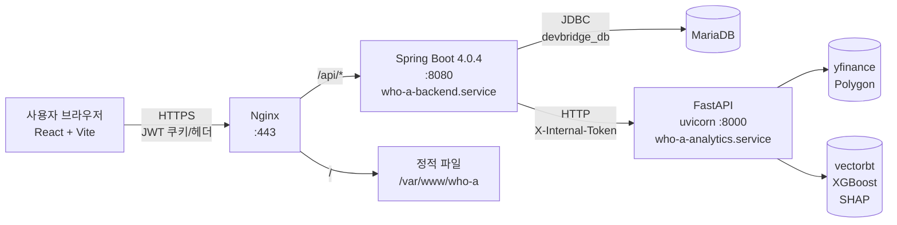
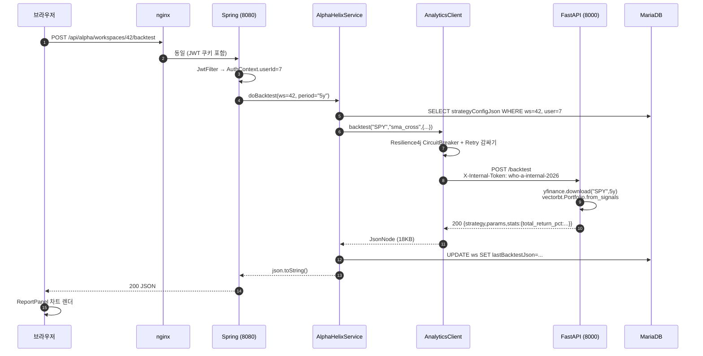

# Alpha-Helix 분석 엔진 아키텍처 — 교수의 강의노트

> 대상: 백엔드/풀스택 입문 ~ 중급
> 시점: 2026-05-26, "Regime / Backtest / TrustScore 가 실제 엔진 출력으로 동작하는 상태"
> 목적: 무엇이 어디서 어떻게 흘러가는지, 그리고 우리가 이번에 무엇을 고쳤는지 처음 보는 사람도 따라올 수 있도록 정리.

---

## 0. 한 줄 요약

> **브라우저 → Nginx → Spring Boot(8080) → Python FastAPI(8000) → yfinance/vectorbt 엔진**
> 사이에 JWT, 내부 토큰, 서킷브레이커, Jackson 직렬화 함정이 숨어 있었음.

---

## 1. 시스템 전체 그림 (3계층)



- **프론트엔드(React)** 는 한 가지 axios baseURL `/api` 만 안다. 누구한테 가는지는 nginx 의 라우팅이 결정.
- **백엔드(Spring Boot)** 는 두 종류 일을 한다: ① DB CRUD/인증/주문/사용자, ② Python 분석 엔진의 **얇은 프록시(thin proxy)**.
- **분석 엔진(FastAPI)** 은 무거운 연산(yfinance 데이터 다운로드, vectorbt 백테스트, regime 라벨링, trust score 합성)을 담당. 외부에 직접 노출되지 않는다 (`127.0.0.1:8000` only).

핵심 디자인: **"무거운 건 파이썬, 가벼운 건 자바, 사용자는 자바만 본다."** 분석 엔진을 통째로 갈아끼울 수 있도록 경계가 잡혀 있다.

---

## 2. 두 개의 컨트롤러 — 왜 둘인가

분석 결과를 받아오는 Spring 컨트롤러는 **두 개**다. 이름이 비슷해서 자주 혼동된다.

| 컨트롤러 | 경로 | 인증 | 역할 |
|---|---|---|---|
| `AnalyticsController` | `/api/analytics/**` | JWT 일반 사용자 | **순수 패스스루**. body 받아서 그대로 파이썬에 던지고 JSON 반환. 디버깅/외부 도구용 |
| `AlphaAnalyticsController` | `/api/alpha/workspaces/{id}/**` | JWT + workspace 소유권 | **워크스페이스 컨텍스트가 있는 호출**. DB에서 ws.strategyConfig 꺼내 ticker/전략 결정 → 파이썬 호출 → 결과를 ws.lastBacktest/lastRegime/lastTrust 컬럼에 영구 저장 |

프론트엔드(`alphaApi.js`의 `runBacktest`, `runRegime`, `runTrust`)가 실제로 누르는 건 **두 번째 컨트롤러**다. 첫 번째는 외부 API 테스트나 관리자용.

이 분리를 못 보면 "왜 컨트롤러 고쳐도 안 변하지?" 하고 한 시간 날린다. 우리가 그랬다.

---

## 3. 호출 한 사이클 — Backtest 한 번

사용자가 워크스페이스에서 ▶ Backtest 버튼을 누르는 순간:



지연 시간 예: SPY 5년 ≈ 0.4 s. 무한매수법 10년 ≈ 5 s.

---

## 4. 두 가지 인증 — JWT 와 Internal Token

데이터를 누구든 마음대로 못 뽑게 하려면 **두 단계 잠금**이 필요했다.

1. **JWT (사용자 ↔ Spring)** — 일반적인 로그인 토큰. `JwtAuthenticationFilter` 가 풀어서 `AuthContext` 에 userId 세팅.
2. **Internal Token (Spring ↔ Python)** — `X-Internal-Token` 헤더. FastAPI 의 모든 엔드포인트가 `Depends(require_internal_token)` 으로 막혀 있어서 헤더가 다르면 **401 Unauthorized**.

FastAPI 가 `127.0.0.1` 만 listen 하므로 외부에서 직접 못 두드린다. 그래도 호스트 내부의 다른 프로세스가 마음대로 못 쓰게 토큰까지 추가한 이중 방어.

**중요한 함정**: Spring 의 token 과 Python 의 token 이 한 글자라도 다르면 모든 분석이 401. 디버깅이 어려운 이유 — Spring 입장에서는 그냥 "Python 이 401 줬다" 만 보이고, Python 로그 켜야 진짜 이유가 보인다.

---

## 5. 회복탄력성 — Resilience4j

`AnalyticsClient.callOnce()` 는 단순 HttpClient 호출이지만, 그걸 감싼 `call()` 메서드가 두 개의 데코레이터를 끼운다.

- **CircuitBreaker** (`analyticsCb`) — 최근 호출 50% 가 실패하면 회로 차단. 그 동안은 즉시 fallback. 30 초 뒤 half-open.
- **Retry** (`analyticsRetry`) — 5xx / IOException 만 3 회 재시도. **4xx 는 재시도 안 함** (`ClientError` 예외로 분리해 retryExceptions 에서 제외).

이게 왜 중요한가: yfinance 가 가끔 NaN 만 주거나, Polygon 키가 만료되거나, 메모리 부족으로 uvicorn 워커가 잠깐 죽는다. 그때마다 사용자한테 500 뱉는 대신 잠시 후 재시도하면 사용자는 모른다.

---

## 6. Workspace 모델 — "기억하는" 백엔드

워크스페이스(`AlphaWorkspace` 엔티티)는 분석 결과를 **JSON 컬럼으로 캐시**한다.

```
alpha_workspace
├─ id, user_id, name, status
├─ goal_profile_json     (목표 — 사용자 → AI 대화로 채움)
├─ strategy_config_json  (전략 — formalize 단계가 채움)
├─ last_backtest_json    (이번 backtest 결과 캐시)
├─ last_regime_json      (이번 regime 결과 캐시)
└─ last_trust_json       (이번 trust score 캐시)
```

장점: 페이지 리로드해도 결과 보임. 단점: stale 데이터 — 사용자가 다시 ▶를 눌러야 갱신. (의도된 트레이드오프)

---

## 7. 자동화 파이프라인 — `doAutoRun`

`AlphaHelixService.doAutoRun()` 은 한 번에 다 돌린다:

```
formalize → backtest → regime → trust → (infinite_buying 만) queue-orders
```

각 단계는 try/catch 로 감싸져 있어서 **regime 만 깨져도 trust 는 계속 시도**한다. 결과 보고서는 단계별 ok/error 를 다 담아 반환.

---

## 8. systemd 로 본 운영 토폴로지

EC2 t3.micro 위에 **두 개의 systemd 유닛**이 돈다.

```
who-a-backend.service   — java -jar /home/ec2-user/app.jar
                          EnvironmentFile=/home/ec2-user/.env.prod
                          Restart=on-failure (StartLimitBurst 필수)

who-a-analytics.service — /opt/who-a/venv/bin/uvicorn app.main:app --port 8000
                          WorkingDirectory=/opt/who-a/analytics
                          Environment=INTERNAL_TOKEN=...
```

배포는 **로컬에서 빌드 → scp app.jar → systemctl restart** 뿐. t3.micro 1 GiB 에선 Gradle 빌드 자체가 OOM 으로 실패하므로 절대 EC2 위에서 빌드하지 말 것.

---

## 9. 이번에 잡은 버그 3종 — 진단서

### 9-1. 포트 미스매치 (8001 vs 8000)
- 증상: 모든 분석 호출이 `ConnectException`.
- 원인: `application.properties` fallback 이 `http://localhost:8001` 인데 Python 은 `8000` 에서 listen.
- 응급조치: `.env.prod` 의 `ANALYTICS_BASE_URL=http://127.0.0.1:8000` + `SPRING_APPLICATION_JSON` 으로 런타임 override.
- 영구 수정: properties 의 fallback 자체를 `8000` 으로 통일.

### 9-2. Internal Token 미스매치
- 증상: 모든 분석 호출이 HTTP 401.
- 원인: Spring 측 `dev-internal-token-change-me` ≠ Python 측 `who-a-internal-2026`.
- 영구 수정: properties 의 fallback 을 `who-a-internal-2026` 으로 통일. `.env.prod` 도 동일 값.

### 9-3. Jackson JsonNode 직렬화 함정 (Spring Boot 4.0 + Jackson 2.x)
- 증상: 응답 200 인데 body 가 `{"array":false,"bigDecimal":false,...,"nodeType":"OBJECT",...}` 367 바이트의 메타데이터만.
- 원인: Spring Boot 4.0 의 `MappingJackson2HttpMessageConverter` 가 `JsonNode` 타입을 받으면 **트리 내용이 아니라 `isArray()`, `isBigDecimal()` 같은 메타 메서드를 reflection 으로 직렬화**한다.
- 영구 수정:
  ```java
  // BAD
  public ResponseEntity<JsonNode> backtest(...) {
      return ResponseEntity.ok(analytics.backtest(...));
  }
  // GOOD
  public ResponseEntity<String> backtest(...) {
      JsonNode n = analytics.backtest(...);
      return ResponseEntity.ok()
              .contentType(MediaType.APPLICATION_JSON)
              .body(n.toString());
  }
  ```
- 교훈: Spring 4.x 에서 Jackson 트리를 컨트롤러 반환 타입으로 직접 쓰지 말 것. `String` + `MediaType.APPLICATION_JSON` 또는 `Map<String,Object>` 로 변환해 반환.

---

## 10. 운영 체크리스트

```bash
# 1. 두 서비스 살아있나
sudo systemctl is-active who-a-backend.service who-a-analytics.service

# 2. 헬스
curl -s http://127.0.0.1:8080/api/analytics/health           # {"analytics":"up"}
curl -s http://127.0.0.1:8000/health -H "X-Internal-Token: $TOK"

# 3. 진짜 엔진 출력 (메타데이터 아닌지 size 로 확인)
curl -s -X POST http://127.0.0.1:8080/api/analytics/backtest \
  -H 'Content-Type: application/json' \
  -d '{"ticker":"SPY","strategy":"sma_cross"}' \
  -w '\nsize=%{size_download}\n' | head -c 400
# size 가 1KB 이상 + 본문에 "stats":{"total_return_pct":... 가 보이면 정상
# size 가 367 근처면 §9-3 회귀
```

---

## 11. 다음 단계 (학생 과제)

1. **Polygon API 키 갱신** — 현재 401 invalid. yfinance fallback 으로만 돌고 있음.
2. **application-local.properties 에 박힌 운영 키 분리** — `.gitignore` + Spring profile.
3. **분석 결과 캐시 TTL** — `last_backtest_json` 에 `generated_at` 박고 5분 이내면 재호출 스킵.
4. **WebSocket 진행률** — 5초 걸리는 무한매수법 백테스트에 프로그레스 바.

---

*"엔진은 작동하고, 토큰은 맞고, 직렬화는 안전하다. 이게 베이스라인이다." — 2026-05-26 메모*
